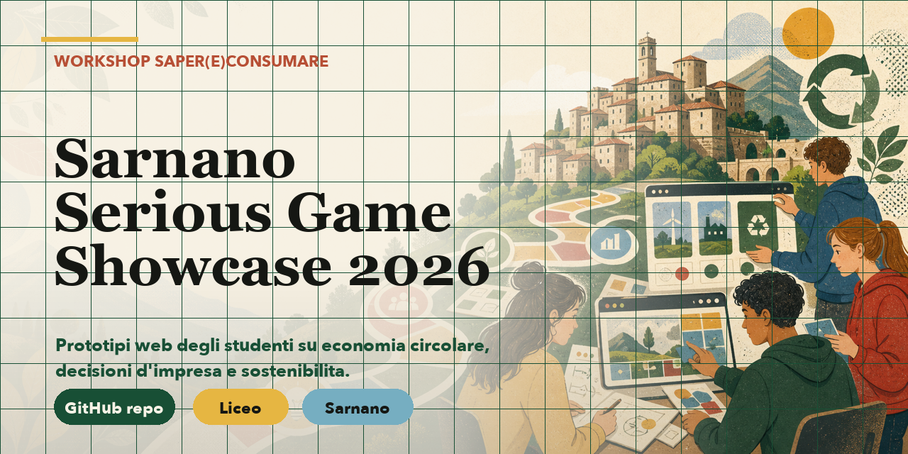

# Sarnano Serious Game Showcase 2026

Directory pubblica dei prototipi realizzati dagli studenti del Liceo di Sarnano durante il workshop **Saper(e)Consumare** dedicato a serious game, economia circolare e decisioni d'impresa sostenibili.

## Contesto

Il workshop fa parte del progetto **"Il prossimo ciclo: Innovazione e Design per l'economia circolare"**, sviluppato dall'Istituto Omnicomprensivo **"A. Gentili - V. Tortoreto"** di Sarnano nell'ambito della piattaforma **Saper(e)Consumare**.

Durante il percorso, gli studenti hanno progettato e prototipato giochi interattivi legati a:

- **SDG 8**: lavoro dignitoso e crescita economica
- **SDG 12**: consumo e produzione responsabili
- scelte d'impresa tra profitto, persone e pianeta
- storytelling interattivo e rapid prototyping web

## Showcase

La landing pubblica del progetto e pubblicata via GitHub Pages:

[Apri lo showcase](https://a-gians.github.io/sarnano-serious-game-showcase-2026/)

## Lavori degli studenti

I prototipi saranno aggiunti progressivamente in `students/`, uno per gruppo.

| Gruppo | Progetto | Stato | Link |
| --- | --- | --- | --- |
| ECoLoGisti | Il Prezzo del Successo | Giocabile | [Apri](./students/ecologisti-prezzo-successo/) |
| Cosm-Etica | Cosm-Etica | Giocabile | [Apri](./students/cosm-etica/) |
| MND | Eudaimonia Corp | Giocabile | [Apri](./students/eudaimonia-corp/) |
| NEXUS | NEXUS | Giocabile | [Apri](./students/nexus/) |
| I Riciclatori | Eco-Risorse Italia | Giocabile | [Apri](./students/eco-risorse-italia/) |

## Struttura della repo

```text
.
├── README.md
├── index.html
├── styles.css
├── script.js
└── students/
    └── <slug-gruppo-progetto>/
```

## Note

I lavori sono prototipi didattici realizzati in tempi brevi. La repo conserva il percorso e rende navigabili i risultati finali del workshop.
